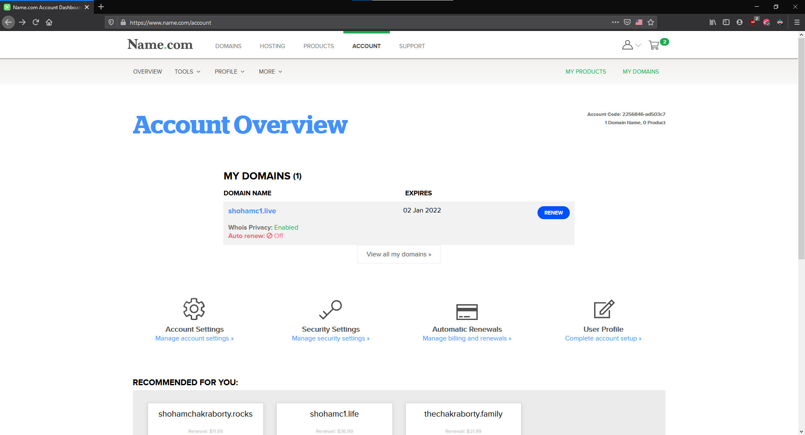
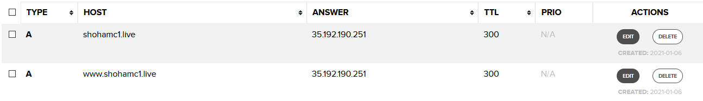

# Custom Domains and TLS

## Connecting to your custom domain

So you just deployed your fancy new website, but telling your friends to visit 35.192.190.251 isn't exactly something fun for you _or_ your friend. This is where your custom domain comes in - instead of some bullshit random numbers you can share your website as a normal URL like ihateregex.io, just like the rest of humanity.

Doing this is actually quite easy. For illustration purposes, I will be using name.com.

### Editing your DNS records

1. From your account overview, go to your domain details (click on the name).
   

2. Go to `Manage DNS records`.
3. Add a new record with the following information

| Type | Host | Answer          | TTL      |
| ---- | ---- | --------------- | -------- |
| A    | @    | `<EXTERNAL IP>` | Anything |

If you want the website to be under a subdomain (e.g. domains.google.com), you can name the subdomain under host. A typical DNS configuration will look something like this.

This will make your website available as both `http://<domain>` and `http://www.<domain>` (useful due to different preferences by different browsers).

4. Once you add the record, wait a while. DNS propogation usually takes a while. _A lower TTL sometimes helps with faster propogation_ (but you should not make the TTL obscenely low). You can check if the DNS records have been updated by running `dig <URL>`.

5. **Update nginx configuration.**
   In our nginx configuration, our output domain was our external IP. However if we visit the site in the current state, we will see the default nginx webpage. This is because there is no nginx configuration that handles requests from that particular domain. Hence we need to change our existing configuration to accept requests from our domain.

   Go back and edit `/etc/nginx/sites-available/flask`. For the `server_name`, remove the IP address and edit it to have your domain names.
   `server_name your_domain www.your_domain;`
   Example: `server_name shohamc1.live www.shohamc1.live;`

6. Once you have edited the configuration, restart nginx (`sudo systemctl restart nginx`) to update the configuration. Now if you visit your domain you should be able to see the website that we were playing with with no issue.

_Yay_

## TLS and HTTPS

Everything looks nice other than the padlock :(
HTTPS is important as it can help prevent packet sniffing and man-in-the-middle attacks. Other than that users are usually wary of sites with no HTTPS and you will be more trustful when you have HTTPS, and get a free SEO boost on the way. **If you are handling any user data on your site, HTTPS is very highly reccommended**.

#### Where to get certificates

Usually there are two major avenues to get TLS certificates.

- From your domain registrar: These certificates are usually paid (3-4 USD per year) and usually do not expire frequently. However depending on the software used, the setup might be involved. _Not covered :/_
- **[Let's Encrypt](https://letsencrypt.org/)**: This non profit organisation will give you free 90 day TLS certificates. This may seem very bad compared to the one from your registrar, however using [EFF's Certbot](https://certbot.eff.org/), we can automate the renewal process.

### certbot

For what it does, certbot is stupid easy to use.

#### Installation

1. **Install snap** (another package manager like `apt`)
   snap comes preinstalled on Ubuntu. You can check for updates by running `sudo snap install core; sudo snap refresh core`
   After that you can install certbot using `sudo snap install --classic certbot`

2. Prepare certbot, run `sudo ln -s /snap/bin/certbot /usr/bin/certbot`
3. Run `sudo certbot --nginx`
   3.1. Enter your email when prompted.
   3.2. Agree to ToS.
   3.3. Agree/disagree to marketing emails (quite infrequent actually).
   3.4. Select all the domains. (enter `1,2` or `1 2`)
4. Certbot should run and complete. If you now visit your site, **you should see the coveted HTTPS badge**. You can test the renewal process by running `sudo certbot renew --dry-run`.

#### [Next](Preventing_Poverty.md)
