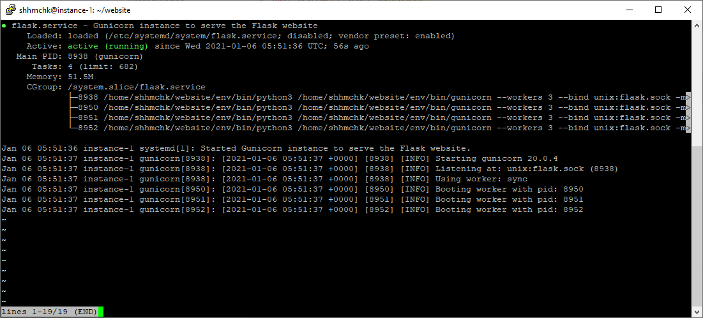

# Deploying a Python web app on GCE (Werkzeug and gunicorn)

## Overall architecture

Here is a (very amateur) drawing of what we are trying to achieve.

#### About gunicorn

gunicorn is a fast and lightweight HTTP server for Python web frameworks. Although Flask comes bundled with a HTTP server of its own, it is meant for developement and testing purposes and does not have various optimisations and security features that are required for public websites, and is generally not written to handle more than a few requests at a time.
Additionally gunicorn can be used to start multiple "workers" of your code which helps with performance.

Some alternatives to gunicorn which you might want to know about are [uWSGI](https://uwsgi-docs.readthedocs.io/en/latest/) and [Twisted Web](https://twistedmatrix.com/trac/wiki/TwistedWeb).

#### About nginx

nginx is a FOSS high performance reverse proxy and load balancer that we can use communicate with our gunicorn worker to send and retrieve data to the end user. nginx can also be used to setup TLS (Transport Layer Security, required for HTTPS) and web caching among other things.

## Before anything else

You should make sure everything is up to date on the server. Run the following commands:

1. `sudo apt update` (find latest versions of packages from online repositories)
2. `sudo apt upgrade` (update all local packages to the latest version)
3. `sudo apt install python3-pip python3-dev build-essential libssl-dev libffi-dev python3-setuptools python3-venv -y` (install the stuff we need to run python)

## A basic deployment

Before looking at the "best practices way", let look at how to get a website up on the cloud ASAP.

1. **Get the code on to your VM.**
   The easiest way to do this is to clone your repo using git. Alternatively you can use applications such as [croc](https://github.com/schollz/croc) to securely send files to your VM.
   For now since we have just one file, we can simply download it by running `wget https://raw.githubusercontent.com/3DCdsc/Cloud_2021/master/files/main.py`
2. Install the Flask dependency. Run `pip3 install Flask`
3. Go to the root directory and **run your flask server** directly.
   This can be done by running `python3 main.py`. You should see something like `Running on http://0.0.0.0:5000/` if everything runs correctly.
4. **Enable port 5000 to be externally accessible.**
   As a security measure, all incoming port connections are blocked by default in GCP. To see our web app, we would need to allow incoming connections to port 5000.

   4.1. Click on the hamburger menu and scroll to the Networking section. Click on VPC network and click on Firewall. Here you can create new firewall rules and edit existing ones.
   4.2. Create a new firewall rule. Give it a descriptive name and optionally a description. Keep direction of traffic at ingress, and allow on match. Under target tags create a tag name. Under source IP type in `0.0.0.0/0` (this allows connections from all IPs from all subnets).
   4.3. Check the box beside TCP and write 5000 in the text box beside it.
   4.4. Go back to your VM settings. Click on the edit button. Scroll down to Network tags (right under Firewall) and type in the tag name you created in 4.5. Save.

5. Once you have done this, port 5000 should be publically accessible. You can go to `http://<EXTERNAL IP>:5000/` and see your website!

## Using gunicorn

Before using gunicorn, we need to setup the python virtual environment.

### Setting up the `venv`

1. `mkdir website`
   Create a new directory for your files. This is always useful, especially for larger projects.
2. `mv main.py website/main.py`
   Move the files inside the new folder. `cd` into this directory.

Before creating the virtual enviornment, we need one more file - `requirements.txt`. This file lists all our dependencies for the project, along with the version numbers to install. You can generate this file by saving the output from `pip3 freeze`.

However, we have already provided a `requirements.txt` file for our use. You can download it inside the top level directory of your project (which is `website` in this case, same location as `main.py`). Download using `wget https://raw.githubusercontent.com/3DCdsc/Cloud_2021/master/files/requirements.txt`

3. **Create a virtual environment.**
   Creating the virtual environment can be done using `python3 -m venv env` (`env` is the name of the virtual environment; you can have multiple environments for a project, but can only have one active at a time). After a short while, the creation should be done and your should be able to see a new folder called `env`.

   Now enter the virtual env by running `source env/bin/activate`. If all goes well, you should see a `(env)` at the start of your bash terminal. To exit from the venv, you can run `deactivate`.

4. **Install dependencies.**
   Using the `requirements.txt` file, we can install all the dependencies inside it. Simply run `pip3 install -r requirements.txt` in the directory with the file.

### Running gunicorn

1. **Install gunicorn.**
   `pip3 install gunicorn`
   Usually developers will not put `gunicorn` in their dependecy files as it is not required for development (is not available on macOS and Windows). The optimal way is to create separate files for dev and prod (production) environments.

2. Run `gunicorn --bind 0.0.0.0:5000 main:app`.
   After running this command, you can try visiting `http://<EXTERNAL IP>:5000/` again, and you should see the website, and it might even load a bit faster! 🙂

#### Understanding this command

gunicorn is a WSGI (Web Server Gateway Interface) server.

`--bind 0.0.0.0:5000` tells gunicorn where to expose the web server. If you remember the way IP addresses work, `0.0.0.0` tells us the network interface to use and `5000` is the port to use. Do note that using `127.0.0.1` or `localhost` does not work as these do not allow the data to be publicly accessible, [see.](https://serverfault.com/a/78058)
`main` is the name of the entry point for the WSGI server, and for our case, it is the same as the file name of the Python file. Some developers and frameworks (notably Django) will create a separate `wsgi.py` file and specify that as the entry point instead.
`app` is the Flask "app". It is an instance of the `Flask` class. [Read more about applications here.](https://flask.palletsprojects.com/en/1.1.x/tutorial/factory/)

WSGI servers are a more advanced topic, but you can read the PEPs (Python Enhancement Proposal) for an in-depth understanding. [PEP 333](https://www.python.org/dev/peps/pep-0333/) and [PEP 3333](https://www.python.org/dev/peps/pep-3333/). WARNING: very technical

### Creating a gunicorn service

We want our terminal to look clean and have everything running in the background, and also have gunicorn run on startup in case anything happens to the server. The way to do this is Linux services.

Creating a service in Linux is very simple (unlike Windows 😜), you just need to create a file under the directory `/etc/systemd/system/`.

#### Writing the service config

1. Create a new file in that directory called `flask.service` (`sudo touch /etc/systemd/system/flask.service`, sudo is required as /etc/ is a protected directory).
2. Edit this file (remember to use `sudo` to be able to write to the file later).
   Paste in the following configuration from [here](https://raw.githubusercontent.com/3DCdsc/Cloud_2021/master/files/flask.service). (we will explain this in the workshop)
   In the config file, edit your username inside (replace `uname`, here your username will be the comment from the private key)
3. Save and exit.

#### Enabling the service

- Start the service with `sudo systemctl start flask` (or the name of the .service file).
- Enable the service with `sudo systemctl enable flask`. Enabling the service will allow it to automatically start on boot.

Check the status of the service by running `sudo systemctl status flask`. If everything is correct, then you should see something like this:

where the service is active and running!

At this point, even though everything is running properly, the website will not be publically accessible as it is still "trapped" within the UNIX socket. To expose the UNIX socket, we will use **nginx** (pronounced engine-x, believe me I called it en-jinks for a whole year without knowing).
