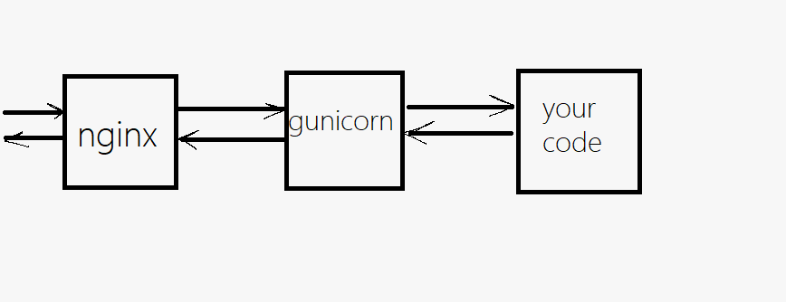

# Deploying a Python web app on GCE

## Overall architecture

Here is a (very amateur) drawing of what we are trying to achieve.

#### About gunicorn

gunicorn is a fast and lightweight HTTP server for Python web frameworks. Although Flask comes bundled with a HTTP server of its own, it is meant for developement and testing purposes and does not have various optimisations and security features that are required for public websites, and is generally not written to handle more than a few requests at a time.
Additionally gunicorn can be used to start multiple "workers" of your code which helps with performance.

Some alternatives to gunicorn which you might want to know about are [uWSGI](https://uwsgi-docs.readthedocs.io/en/latest/) and [Twisted Web](https://twistedmatrix.com/trac/wiki/TwistedWeb).

#### About nginx

nginx is a FOSS high performance reverse proxy and load balancer that we can use communicate with our gunicorn worker to send and retrieve data to the end user. nginx can also be used to setup TLS (Transport Layer Security, required for HTTPS) and web caching among other things.

## Before anything else

You should make sure everything is up to date on the server. Run the following commands:

1. `sudo apt update` (find latest versions of packages from online repositories)
2. `sudo apt upgrade` (update all local packages to the latest version)
3. `sudo apt install python3-pip python3-dev build-essential libssl-dev libffi-dev python3-setuptools -y` (install the stuff we need to run python)

## A basic deployment

Before looking at the "best practices way", let look at how to get a website up on the cloud ASAP.

1. **Get the code on to your VM.**
   The easiest way to do this is to clone your repo using git. Alternatively you can use applications such as [croc](https://github.com/schollz/croc) to securely send files to your VM.
2. Go to the root directory and **run your flask server** directly.
   This can be done by running `python3 main.py`. You should see something like `Running on http://0.0.0.0:5000/` if everything runs correctly.
3. **Enable port 5000 to be externally accessible.**
   As a security measure, all incoming port connections are blocked by default in GCP. To see our web app, we would need to allow incoming connections to port 5000.

   3.1. Click on the hamburger menu and scroll to the Networking section. Click on VPC network and click on Firewall. Here you can create new firewall rules and edit existing ones.
   3.2. Create a new firewall rule. Give it a descriptive name and optionally a description. Keep direction of traffic at ingress, and allow on match. Under target tags create a tag name. Under source IP type in `0.0.0.0/0` (this allows connections from all IPs from all subnets).
   3.3. Go back to your VM settings. Click on the edit button. Scroll down to Network tags (right under Firewall) and type in the tag name you created in 3.2. Save.

4. Once you have done this, port 5000 should be publically accessible. You can go to `http://<EXTERNAL IP>:5000/` and see your website!

## Using gunicorn
