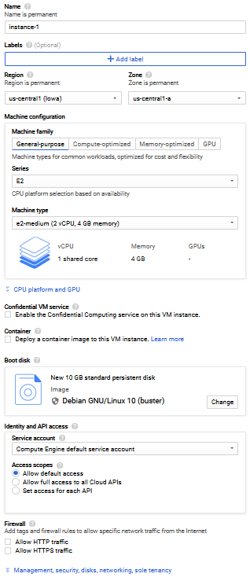

# Creating an instance on Google Compute Engine

1. Click on the hamburger menu, scroll down to the `Compute` section and click on Compute Engine.
2. Click on VM instances.
3. Click on the `Create Instance` button at the top.
4. Once you have chosen the options you want, click on `Create` and GCP will start creating your VM. When you see a green tick next to the name of your VM, it is ready to connect to.

> ❗ GCP Free Tier gives you one f1-micro instance in us-west1, us-central1 and us-east1 regions every month. [More.](https://cloud.google.com/free)

### Explaining this screen

| On screen               | What it means                                                                                                                                                                                                                                   |
| ----------------------- | ----------------------------------------------------------------------------------------------------------------------------------------------------------------------------------------------------------------------------------------------- |
| Name                    | The "name" of your instance. It is used to identify a specific instance in your project (useful when you have many instances in the same project). This is also the hostname in the OS..                                                        |
| Labels                  | You can use labels to apply generic properties to your instances. (we will not be covering this)                                                                                                                                                |
| Region                  | The region where your instance will be located. Usually you want to choose a region closest to you/your users for lowest latency.                                                                                                               |
| Zone                    | A location within a region. For the scope of this workshop, anything is fine. However for larger applications, you will want most, if not all of your components in a single zone so that the latency is minimised and throughput is maximised. |
| Machine family          | GCE offers different types of instances depending on your application. Depending upon your final application you can choose the correct family, however the general purpose machines are suitable for most purposes.                            |
| Series                  | Basically what physical CPU the VM is based on. N2 is Intel powered, N2D is AMD EPYC powered, etc. E2 series is you use whatever is most available (i.e. you don't care about CPU).                                                             |
| Machine type            | The "instance class" of your VM. This option says how powerful your VM is.                                                                                                                                                                      |
| Confidential VM service | Some security thing idk                                                                                                                                                                                                                         |
| Container               | If you want to use Docker images to deploy to GCE.                                                                                                                                                                                              |
| Boot Disk               | Choose which OS will be installed on your VM. You can also use this to clone existing machines or build a VM from a saved instance (snapshots). You can also edit the disk size in this menu.                                                   |
| Identity and API access | What other GCP stuff you want your instance to have access to. If you want to call the GCP TTS API from the VM instance you have to give it the necessary permissions to do so.                                                                 |
| Firewall                | Allow HTTP/HTTPS access                                                                                                                                                                                                                         |

#### Explaining some more terms

**vCPU** - means a virtualised CPU core. Usually every CPU thread is a vCPU core.
**Shared core** - for development purposes, you might need access to a very small machine, which is when you use a shared core machine. In these machines, multiple people share the same vCPU.
**Standard** - You get complete ownership of the full vCPU. However, you might still be sharing the physical machine with other people.

> ❓ _What if I want a whole server to myself?_
> In this case you would want to buy a bare metal server. However these are usually very expensive and aren't as scaleable. [Amazon offers on demand bare metal EC2 servers.](https://aws.amazon.com/about-aws/whats-new/2019/02/introducing-five-new-amazon-ec2-bare-metal-instances/)

#### [Next](Connecting.md)
