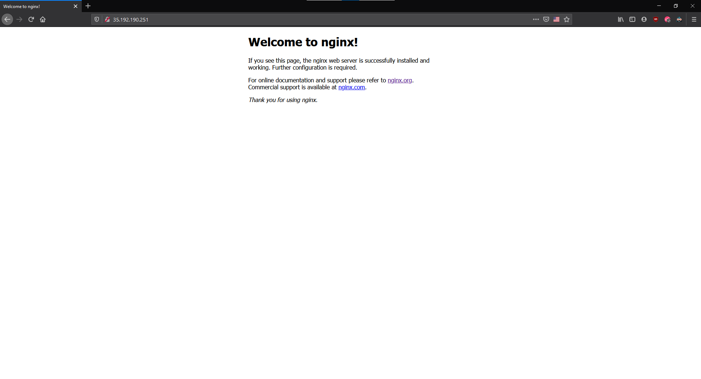

# nginx

(_or NGINX or nginx or NginX, idk anymore_)

So we have our website stuck on some weird UNIX socket and we want to get it out into the world. nginx can help you do that (and a lot more).

### Installing nginx

```bash
sudo apt install nginx
```

To check if the installation has succeeded, you can run `systemctl status nginx`. If the service is active, you can visit `http://<EXTERNAL IP>/` and you should be able to see a welcome page.



### Setting up the reverse proxy

Similar to the service configuration, setting up nginx is just as easy as creating a file. The (default) directory for the configuation is `/etc/nginx/sites-available/`.

1.  Create a new file, call it `flask` (for the sake of continunity from the other configs, you'll thank yourself when things go wrong). Note that there is no file extension for nginx configurations.
    ```bash
    touch /etc/nginx/sites-available/flask
    ```
2.  Open it in your shitty editor. Put in this config.

    ```
    server {
        listen 80;
        server_name <EXTERNAL IP>;

        location / {
            include proxy_params;
            proxy_pass http://unix:/home/[uname]/website/flask.sock;
        }
    }
    ```

    `website` is the name of the folder where the WSGI entry point (i.e. our Python file), and `flask` the name of the socket inside the service config file. Put in the correct values if you changed them in any previous configurations.

3.  Link the config to the `sites-enabled` directory.
    ```bash
    sudo ln -s /etc/nginx/sites-available/flask /etc/nginx/sites-enabled
    ```
4.  Check for errors
    ```bash
    sudo nginx -t
    ```
5.  If there are no errors, then restart the nginx process to update the configuration.
    ```bash
    sudo systemctl restart nginx
    ```

At this point, nginx has been set up! If there are no errors, then you can visit `http://<EXTERNAL IP>/` and you should be able to see your site.

Now that our server is all setup, all we need to do is to connect it to our domain and get that HTTPS badge. 😁

### How to access logs

- `sudo less /var/log/nginx/error.log`: checks the Nginx error logs.
- `sudo less /var/log/nginx/access.log`: checks the Nginx access logs.
- `sudo journalctl -u nginx`: checks the Nginx process logs.
- `sudo journalctl -u myproject`: checks your Flask app’s Gunicorn logs.

`less` is used to check the contents of the file, but it is different from `cat` as it allows you to scroll through the file instead of dumping everything on the terminal (which makes it better for larger files).
To exit from a `less` dialogue, press `q`.
